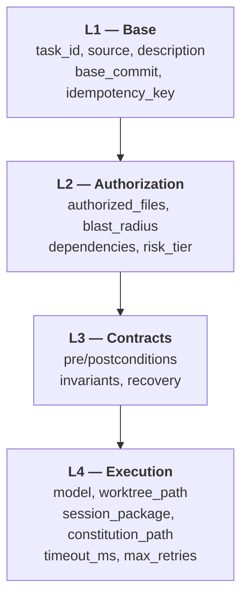
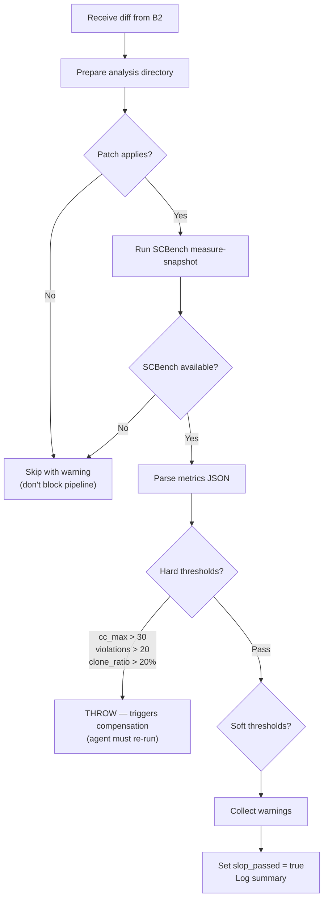
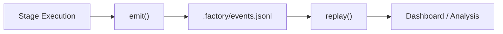
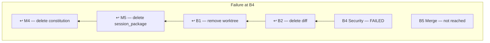
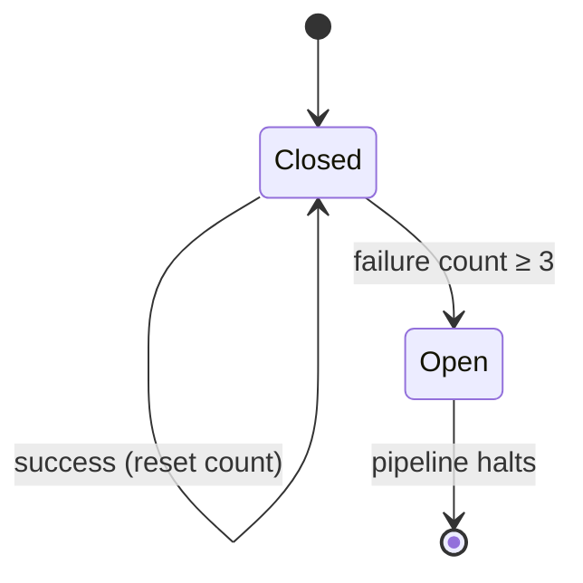
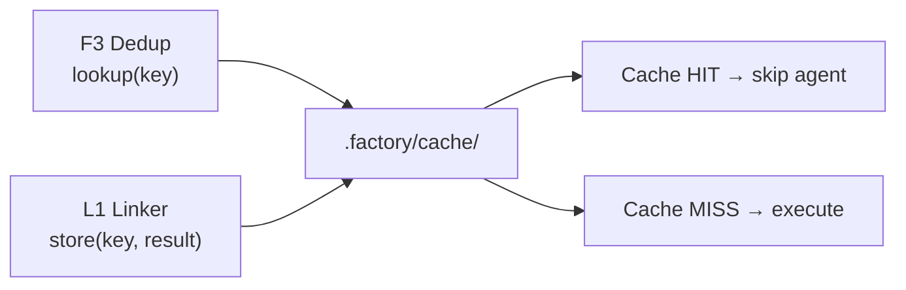

# Factory Compiler Pipeline

A TypeScript compiler pipeline that processes AI coding tasks through staged execution with event sourcing, design-by-contract enforcement, saga-pattern compensation, and integrated code quality gates.

## Overview

The pipeline compiles high-level task descriptions into verified, merged code changes by lowering them through 16 stages across four groups: **Frontend** (parse & classify), **Middle** (plan & package), **Backend** (execute, verify & gate), and **Linker** (finalize & cache).

```
npm start        # run the pipeline
npm run typecheck # type-check without emitting
npm run metrics   # run SCBench metrics directly
```

---

## Pipeline Architecture

```mermaid
flowchart LR
  subgraph Frontend
    F1[F1 Parse] --> F2[F2 Validate] --> F3[F3 Dedup] --> F4[F4 Risk]
  end
  subgraph Middle
    M1[M1 Deps] --> M2[M2 Conflicts] --> M3[M3 Model] --> M4[M4 Constitution] --> M5[M5 Session]
  end
  subgraph Backend
    B1[B1 Worktree] --> B2[B2 Execute Agent] --> B3[B3 Verify] --> B3_5[B3.5 Slop Analysis] --> B4[B4 Security] --> B5[B5 Merge]
  end
  subgraph Linker
    L1[L1 Link & Finalize]
  end
  F4 --> M1
  M5 --> B1
  B5 --> L1
```



Each stage declares **requires** (input property flags) and **provides** (output property flag). The orchestrator enforces this dependency chain at runtime — a stage cannot execute until all its required properties are set.

---

## Stage Reference

### Frontend — Parse, Validate, Deduplicate, Classify

| Stage | ID | Kind | Provides | Description |
|---|---|---|---|---|
| Parse Task | F1 | analysis | `PROP_parsed` | Assigns `task_id`, `source`, `base_commit`, computes `idempotency_key` (SHA-256) |
| Validate Spec | F2 | analysis | `PROP_validated` | Rejects descriptions shorter than 5 characters |
| Dedup Check | F3 | analysis | `PROP_deduped` | Looks up idempotency key in action cache; sets `cache_hit` flag |
| Risk Classification | F4 | analysis | `PROP_risk_classified` | Classifies risk tier (1–3) and blast radius from description keywords |

### Middle — Dependency Analysis, Model Selection, Session Packaging

| Stage | ID | Kind | Provides | Description |
|---|---|---|---|---|
| Dependency Analysis | M1 | analysis | `PROP_dependencies_analyzed` | Resolves file dependencies and authorized file globs |
| Conflict Prediction | M2 | analysis | `PROP_conflict_checked` | Predicts merge conflict risk |
| Model Selection | M3 | analysis | `PROP_model_selected` | Selects Claude model by risk tier (tier 3 → Opus, tier 2 → Sonnet, tier 1 → Haiku) |
| Constitution Generation | M4 | transform | `PROP_constitution_generated` | Generates agent constitution (rules + constraints) |
| Session Package | M5 | transform | `PROP_session_packaged` | Bundles model, constitution, authorized files, and timeouts into session package |

### Backend — Execute, Verify, Gate, Merge

| Stage | ID | Kind | Provides | Description |
|---|---|---|---|---|
| Create Worktree | B1 | transform | `PROP_worktree_created` | Provisions isolated worktree directory |
| Execute Agent | B2 | transform | `PROP_executed` | Runs the coding agent; produces `artifacts.diff` |
| Verify Output | B3 | analysis | `PROP_verified` | SWE-bench style verification (`fail_to_pass` / `pass_to_pass`) |
| **Slop Analysis** | **B3.5** | **analysis** | **`PROP_slop_reviewed`** | **Code quality gate using SCBench metrics** |
| Security Review | B4 | analysis | `PROP_security_reviewed` | Scans diff for leaked secrets |
| Merge | B5 | transform | `PROP_merged` | Commits the verified, quality-checked diff |

### Linker — Finalize

| Stage | ID | Kind | Provides | Description |
|---|---|---|---|---|
| Link & Finalize | L1 | transform | `PROP_linked` | Stores result in action cache for future deduplication |

---

## Task IR — Progressive Lowering

Tasks are progressively enriched as they flow through stages, following a 4-level intermediate representation:



| Level | Added By | Fields Added |
|---|---|---|
| L1 | F1 Parse | `task_id`, `source`, `description`, `base_commit`, `idempotency_key` |
| L2 | F4 Risk, M1 Deps | `authorized_files`, `blast_radius`, `dependencies`, `risk_tier` |
| L3 | M4 Constitution | `preconditions`, `postconditions`, `invariants_hard`, `invariants_soft`, `recovery` |
| L4 | M3 Model, M5 Session | `model`, `worktree_path`, `session_package`, `constitution_path`, `timeout_ms`, `max_retries` |

---

## Property Flag Progression

The pipeline tracks completion through 16 property flags. Each stage checks its `requires` flags before executing and sets its `provides` flag on success.

```mermaid
flowchart LR
  p1(PROP_parsed) --> p2(PROP_validated) --> p3(PROP_deduped) --> p4(PROP_risk_classified)
  p4 --> p5(PROP_dependencies_analyzed) --> p6(PROP_conflict_checked) --> p7(PROP_model_selected) --> p8(PROP_constitution_generated) --> p9(PROP_session_packaged)
  p9 --> p10(PROP_worktree_created) --> p11(PROP_executed) --> p12(PROP_verified) --> p13(PROP_slop_reviewed) --> p14(PROP_security_reviewed) --> p15(PROP_merged) --> p16(PROP_linked)
```



---

## Slop Detection (B3.5)

The slop analysis stage sits between verification (B3) and security review (B4). It measures structural code quality in the agent's diff output using [SCBench](https://github.com/SprocketLab/slop-code-bench) metrics, ensuring the coding agent is held accountable for quality — not just correctness.

### How It Works



### Metrics Collected

| Metric | Description |
|---|---|
| `cc_max` | Maximum cyclomatic complexity across all functions |
| `cc_mean` | Mean cyclomatic complexity |
| `cc_high_count` | Number of functions with CC > 10 |
| `lint_errors` | Total lint errors |
| `ast_grep_violations` | Structural anti-pattern violations detected by AST-grep rules |
| `clone_ratio` | Code duplication ratio (0.0–1.0) |
| `trivial_wrappers` | Functions that only delegate to another function |
| `single_use_functions` | Functions called from exactly one site |
| `loc` | Lines of code |
| `delta_loc` | LOC change from last run (null on first run) |
| `delta_cc_high_count` | Change in high-CC function count |
| `delta_ast_grep_violations` | Change in violation count |
| `delta_churn_ratio` | Code churn ratio change |

### Thresholds

**Hard thresholds** — pipeline fails, compensation triggers, agent re-runs:

| Metric | Threshold | Error |
|---|---|---|
| `cc_max` | > 30 | `Slop gate FAILED: cyclomatic complexity too high` |
| `ast_grep_violations` | > 20 | `Slop gate FAILED: too many slop-rule violations` |
| `clone_ratio` | > 0.20 | `Slop gate FAILED: excessive code duplication` |

**Soft thresholds** — warnings collected, pipeline continues:

| Metric | Threshold | Warning |
|---|---|---|
| `cc_max` | > 15 | `cc_max elevated` |
| `ast_grep_violations` | > 5 | `ast_grep_violations elevated` |
| `clone_ratio` | > 0.05 | `clone_ratio elevated` |
| `trivial_wrappers` | > 3 | `trivial_wrappers: N` |
| `lint_errors` | > 10 | `lint_errors: N` |
| `delta_cc_high_count` | > 0 | `complexity growing` |
| `delta_ast_grep_violations` | > 0 | `slop violations increasing` |

### Graceful Degradation

SCBench is a Python package (`pip install slop-code-bench`). If it is not installed, the stage logs `SLOP: ⚠ skipped (scbench not available)`, sets `slop_passed = true`, and allows the pipeline to continue. The same graceful skip applies if patching fails or any unexpected error occurs.

---

## Core Infrastructure

### Event Sourcing

Every pipeline action emits a timestamped event to `.factory/events.jsonl` (append-only JSONL). Events enable full auditability and replay.



**Event types**: `TaskCreated`, `StageStarted`, `StageCompleted`, `StageFailed`, `CompensationStarted`, `CompensationCompleted`, `CacheHit`, `CacheMiss`, `CacheStore`, `CircuitBreakerTripped`, `PipelineCompleted`, `PipelineFailed`

### Design by Contract

Every stage defines a `StageContract` with four categories of checks:

| Check Type | Timing | On Failure |
|---|---|---|
| **Preconditions** | Before execute | Throws `ContractViolation` |
| **Postconditions** | After execute | Throws `ContractViolation` |
| **Hard invariants** | Before and after execute | Throws `ContractViolation` |
| **Soft invariants** | Before and after execute | Logs warning, continues |

### Compensation (Saga Pattern)

Transform stages can register a `compensate()` handler. On failure, the pipeline unwinds compensation handlers in LIFO order (rest-for-one supervision):



Only `transform` stages register compensation handlers. `analysis` stages are side-effect-free and require no undo.

### Circuit Breaker

The pipeline tracks consecutive failures per stage. After 3 failures of the same stage, the circuit breaker trips and the pipeline halts immediately without attempting execution.



### Action Cache

Tasks are deduplicated via SHA-256 hashing of `{description, base_commit}`. The F3 (Dedup) stage checks the cache; the L1 (Linker) stage writes to it. Cache files are stored as JSON under `.factory/cache/`.



### Retry Policies

Each stage configures its own retry behavior:

| Policy | Behavior | Used By |
|---|---|---|
| `never` | No retries; fail immediately | B3, B3.5, B4 (deterministic stages) |
| `on_error` | Retry on thrown errors | F1–F4, M1–M5, B1, L1 |
| `always` | Retry regardless of outcome | B2 (agent execution — inherently non-deterministic) |

Backoff delays are configured per-stage via `backoff_ms` arrays (e.g., B2 uses `[100, 200, 400]`).

---

## Project Structure

```
src/
├── cli.ts                    # Entry point — runs pipeline, prints summary
├── types.ts                  # All interfaces and type definitions
├── core/
│   ├── pipeline.ts           # Orchestrator — retry, circuit breaker, stage runner
│   ├── event-store.ts        # Append-only event log (.factory/events.jsonl)
│   ├── action-cache.ts       # SHA-256 dedup cache (.factory/cache/)
│   ├── compensation.ts       # LIFO compensation stack (saga pattern)
│   ├── contracts.ts          # Pre/postcondition and invariant enforcement
│   └── slop-runner.ts        # SCBench shell-out helper
└── stages/
    ├── frontend.ts           # F1–F4: parse, validate, dedup, risk
    ├── middle.ts             # M1–M5: deps, conflicts, model, constitution, session
    ├── backend.ts            # B1–B5 + B3.5: worktree, execute, verify, slop, security, merge
    └── linker.ts             # L1: finalize and cache
```

### Runtime Artifacts

The pipeline creates a `.factory/` directory at runtime:

```
.factory/
├── events.jsonl              # Event sourcing log
├── cache/                    # Action cache (SHA-256 keyed JSON)
├── worktrees/                # Isolated worktree directories per task
├── constitutions/            # Generated agent constitutions
└── slop_analysis/            # Temporary directories for slop analysis
```

---

## Example Output

```
═══════════════════════════════════════════════════════
  Factory Compiler Pipeline — Prototype
═══════════════════════════════════════════════════════

── Run 1: Fresh task ──────────────────────────────────
  ▸ F1 (Parse Task)
  ▸ F2 (Validate Spec)
  ▸ F3 (Dedup Check)
  ▸ F4 (Risk Classification)
  ▸ M1 (Dependency Analysis)
  ▸ M2 (Conflict Prediction)
  ▸ M3 (Model Selection)
  ▸ M4 (Constitution Generation)
  ▸ M5 (Session Package)
  ▸ B1 (Create Worktree)
    worktree → .factory/worktrees/task_abc123
  ▸ B2 (Execute Agent)
  ▸ B3 (Verify Output)
    FAIL_TO_PASS: ✓  PASS_TO_PASS: ✓
  ▸ B3.5 (Slop Analysis)
    SLOP: ✓  cc_max=8  violations=2  clone=3.1%  [0 warnings]
  ▸ B4 (Security Review)
  ▸ B5 (Merge)
    merged → merge_abc456
  ▸ L1 (Link & Finalize)
    cached result under key 4a9907eebad6...

  Result: SUCCESS

── Run 2: Same task (expect cache hit) ───────────────
  ▸ F1 (Parse Task)
  ▸ F2 (Validate Spec)
  ▸ F3 (Dedup Check)
    ✓ cache HIT — returning cached result
  ...
  ▸ B3.5 (Slop Analysis)
    SLOP: ⚠ skipped (scbench not available)
  ...

  Result: SUCCESS
  Cache hit: true

── Slop Analysis (Run 1) ─────────────────────────────
   cc_max=8  violations=2  clone=3.1%  loc=142

── Event Log: 72 events ──────────────────────────
  TaskCreated: 2
  StageStarted: 32
  StageCompleted: 32
  ...

═══════════════════════════════════════════════════════
  Done.
═══════════════════════════════════════════════════════
```

---

## Prerequisites

- **Node.js** (ES2022 compatible)
- **TypeScript** 5.5+
- **Python 3** + `slop-code-bench` (optional — pipeline degrades gracefully without it)

```bash
# Install Node dependencies
npm install

# Optional: install SCBench for slop analysis
pip install slop-code-bench
```
